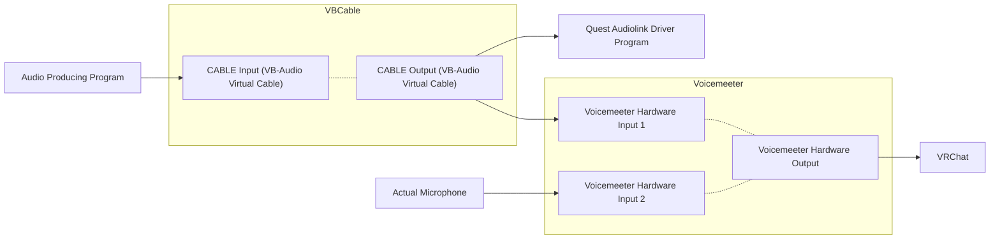

# Quest Audiolink Driver
This project has multiple different goals, all working towards getting Audiolink more accessible and functional on quest.

## Quest Avatar Audiolink
This is facilitated through a special sender avatar that a PC user wears, which sends data over physbone contacts to quest users. Part of this program extracts the audiolink data from a screenspace shader on the sender avatar, and then sends it back to the game into the animator controller using OSC.

## Audiolink Emulator
This part of the program allows you to pipe audio into the program and run the audiolink system on it, which then gets fed into the game using the same system as the screenspace shader. This allows you to play music using your mic and properly run audiolink from it. There is an optional toggle to drive a minimal version of the audiolink texture into the world, allowing anyone with audiolinked shaders to also receive the data with no modifications.

## Virtual Audio Cable Setup
This is a demonstration of the path audio takes through the system, and how to link the required programs together. This is not required if you are just using the in-world extractor to get audiolink data to quest, but if you are using the emulator, you will need to set this up to properly pipe isolated audio into the program.

